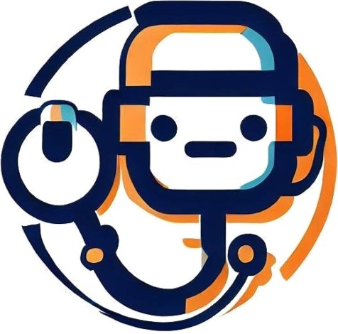
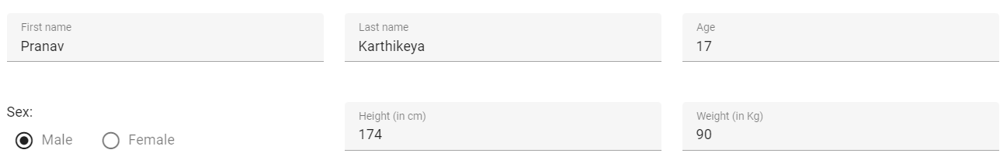
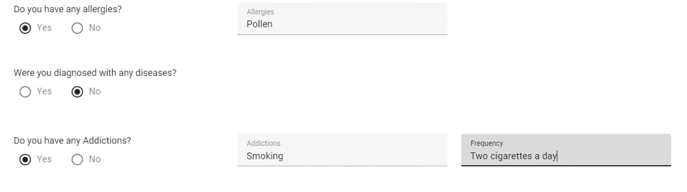
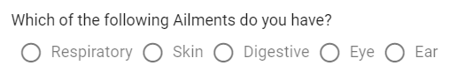
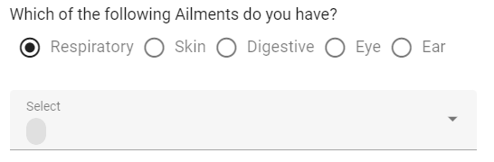
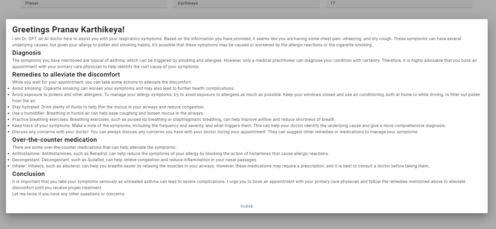
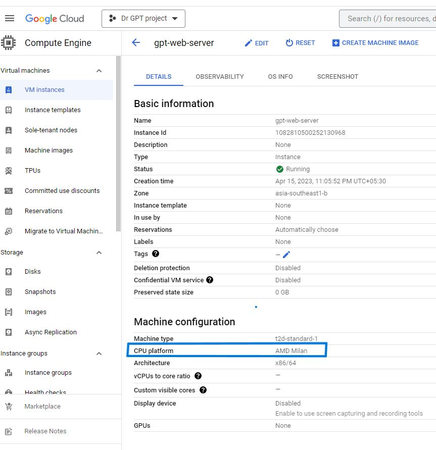

{width="5.674239938757656in"
height="5.596415135608049in"}\
\
Dr. GPT\
AI Doctor

> Team: Melted Ice cream

-   Praval Pattam

-   Krishna Harsha Mamillapalli

# Contents {#contents .TOC-Heading}

[Introduction [3](#introduction)](#introduction)

[The Problem [3](#the-problem)](#the-problem)

[The Solution [3](#the-solution)](#the-solution)

[User Guide [4](#user-guide)](#user-guide)

[How are we different from our competitors?
[6](#how-are-we-different-from-our-competitors)](#how-are-we-different-from-our-competitors)

[Technical Stack [6](#technical-stack)](#technical-stack)

[Deployment [6](#deployment)](#deployment)

[Challenges Faced: [7](#challenges-faced)](#challenges-faced)

[Next Steps [7](#next-steps)](#next-steps)

[Solving for India Hackathon
[8](#solving-for-india-hackathon)](#solving-for-india-hackathon)

# Introduction

Greetings, this is Team Melted Ice cream's submission for the Google X
AMD: Solving for India hackathon.

Our project is based on the theme Health-Tech called Dr. GPT, an AI
Doctor

# The Problem

A lot of people avoid seeking medical attention, these can be due to
various factors but according to a study conducted over one-third of
participants (33.3% of 1,369) reported unfavourable evaluations of
seeking medical care, such as factors related to physicians, health care
organizations, and affective concerns.

These people look to online, friends and other options for a quick
diagnosis and over the counter medication. Some of these people google
their symptoms to get a basic diagnosis and over the counter medication.
Unfortunately, this can be time consuming, can lead them down rabbit
holes and often tend to develop Cyberchondria.

# The Solution

Dr. GPT is an AI diagnostic tool, that can provide a quick way to check
one's symptoms and is the ideal solution for those who need detailed
diagnosis, remedies to alleviate the discomfort and over the counter
medication. Since Dr. GPT is on based on an LLM which is trained on a
humongous data set that might even be greater than the knowledge
possessed by the common man. This makes Dr. GPT better than asking
friends and family for remedies and googling.

Dr. GPT takes a user's inputted data based on which it provides the user
with their diagnosis in an efficient manner that consumes way less time
than consulting a doctor (Although we urge you to consult a certified
medical practitioner if symptoms persist). The diagnosis could be
specific, or it could give possibilities of what the disease might be.
It will also provide you with remedies and suggestions on what to do
next. The application also gives handy tips regarding lifestyle changes
which are a necessity to lead a healthy life.

# User Guide

1.  As the application opens, the user must fill in their details in the
    respective text boxes. These details include Name, height, weight,
    age.

> {width="5.310605861767279in"
> height="0.8537215660542432in"}
>
> It is mandatory to answer each field.

2.  The User is then asked to fill in Medical History such as previously
    diagnosed allergies, diseases by entering them into a text box which
    appears on selecting the 'Yes' option.

> {width="5.348040244969379in"
> height="1.4972856517935258in"}

3.  After filling in the medical information, the user can choose one
    option amongst various possible ailments provided.

> {width="4.367361111111111in"
> height="0.6916666666666667in"}

4.  On selecting a Broader Category of ailments, a drop-down appears
    with a list of symptoms going into specifics.

> {width="3.9984853455818024in"
> height="1.3181813210848643in"}

5.  The user can choose the necessary symptoms and press the submit
    button.

> {width="2.2618307086614173in"
> height="1.8626323272090988in"}
>
> {width="2.414530839895013in"
> height="0.5301279527559055in"}

6.  Once the user submits their response, A dialogue box appears after
    clicking the submit button with the user's diagnosis.

> {width="1.5769225721784776in"
> height="0.47164698162729657in"}
>
> The average wait time is usually 2 minutes or 120 seconds. So, please
> be patient.

7.  Finally, we get the diagnosis in a simple and a very readable format
    (unlike a doctor's writing)

> {width="5.687307524059492in"
> height="2.358707349081365in"}

# How are we different from our competitors?

Symptom Checker apps such as Ada, WebMD, and others store their data
regarding diseases and their respective symptoms in large databases.
These large data sets must be updated. 

One of the places we put ourselves away and ahead of our competitors is
by adopting new technologies like ChatGPT into our application. ChatGPT
trained on large data sets diagnoses diseases and can also give remedies
to keep the ailment under control. ChatGPT saved a lot of time and money
that other apps have put into developing and maintaining their
databases.

Symptom checker apps ask many questions, of which few might be
unnecessary or totally out of context. We filtered out the required
questions and condensed all questions regarding symptoms into a
dropdown, thus speeding the diagnosis and saving the user's time.

# Technical Stack

+---------------------+------------------------------------------------+
| User Interface      | Vue.js with Vuetify components                 |
+=====================+================================================+
| API                 | Flask framework with Python                    |
+---------------------+------------------------------------------------+
| AI/ML               | ChatGPT                                        |
|                     |                                                |
|                     | Model: GPT 3.5 Turbo                           |
+---------------------+------------------------------------------------+
| Web Server          | Nginx                                          |
+---------------------+------------------------------------------------+
| OS                  | Linux                                          |
+---------------------+------------------------------------------------+

# Deployment

Deployed on Google Cloud and AMD instances (Specifically the T2D Series)

> {width="3.5666721347331585in"
> height="3.6808716097987753in"}

The web application has been deployed on Google Compute Engine

Application URL; <http://34.143.138.12/>

and all the source code has been made available on
<https://github.com/PravalPattam/DrGPT>

# Challenges Faced:

Below are the technical challenges faced by us during this project:

-   Getting ChatGPT api working as the OpenAI documentation is not
    detailed.

-   Learning curve with Google Cloud and Technical stack we are using.

# Next Steps

The MVP can be extended to help users as a single stop for all the
medical diagnosis. Below are the enhancements for Dr. GPT:

-   Show Dr. GPT advise progressively.

> Currently the application gets the entire response for GPT API and
> shows it all together. This makes user to wait for 1 to 2 mins.
> Instead of this we can extend the application to show the message in
> chunks. This is similar to typing the message (as done by ChatGPT)

-   User personalization

> Have a personal page for every user where they can review their
> current and past advice.

-   Health news

> Provide latest health news.

-   Healthy Living

> Provide advice to users for healthy living.

-   Gamification

> Help users to follow healthy practices through gamification.

-   Geolocation

> Shows the user the nearest medical specialist using geolocation and
> gps.

# Solving for India Hackathon

Below are the details for Hackathon

  ------------------------- ----------------------------------------------------------------------------------------
  Project Title             Dr. GPT, an AI Doctor

  Project Description       Dr. GPT is an AI diagnostic tool, that can provide a quick way to check one's symptoms
                            and is the ideal solution for those who need detailed diagnosis, remedies to alleviate
                            the discomfort and over the counter medication. Dr. GPT is better than googling or
                            asking friends and family for remedies.

  Theme                     Health-Tech

  Google Cloud              Web App deployed on Google Compute Engine

  AMD instance              CPU platform: AMD Milan\
                            Machine type: T2D

  Web App URL               <http://34.143.138.12/>

  Github URL                <https://github.com/PravalPattam/DrGPT>

  Google Drive Link for the <https://drive.google.com/drive/folders/1NLMH_lCS7g-_JLYPHu-MXDMn9Bd8NdvK?usp=sharing>
  Demo video and            
  Documentation             
  ------------------------- ----------------------------------------------------------------------------------------
